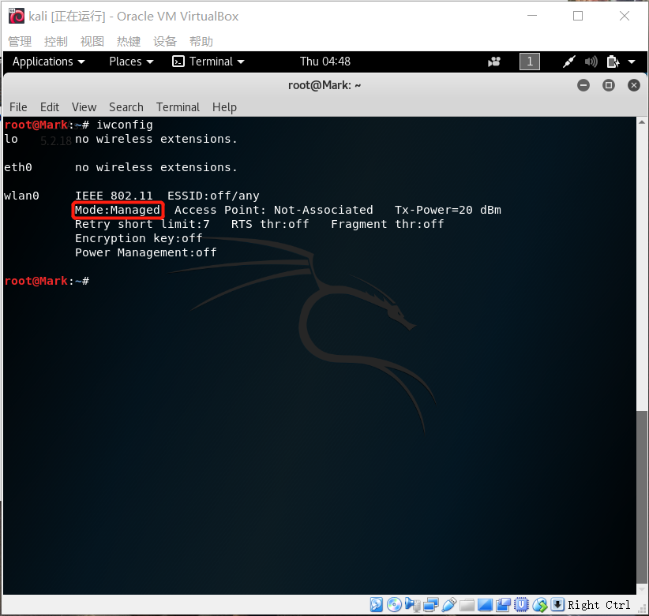
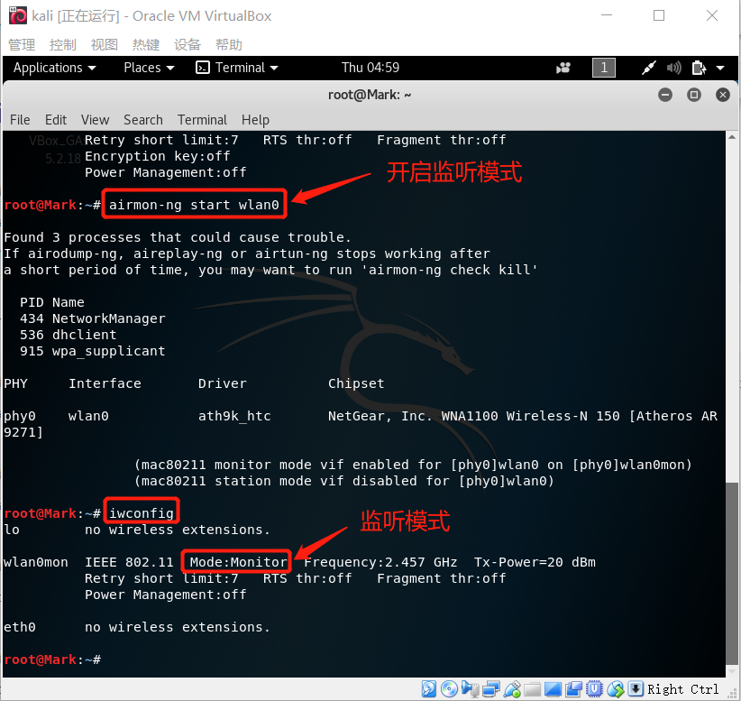
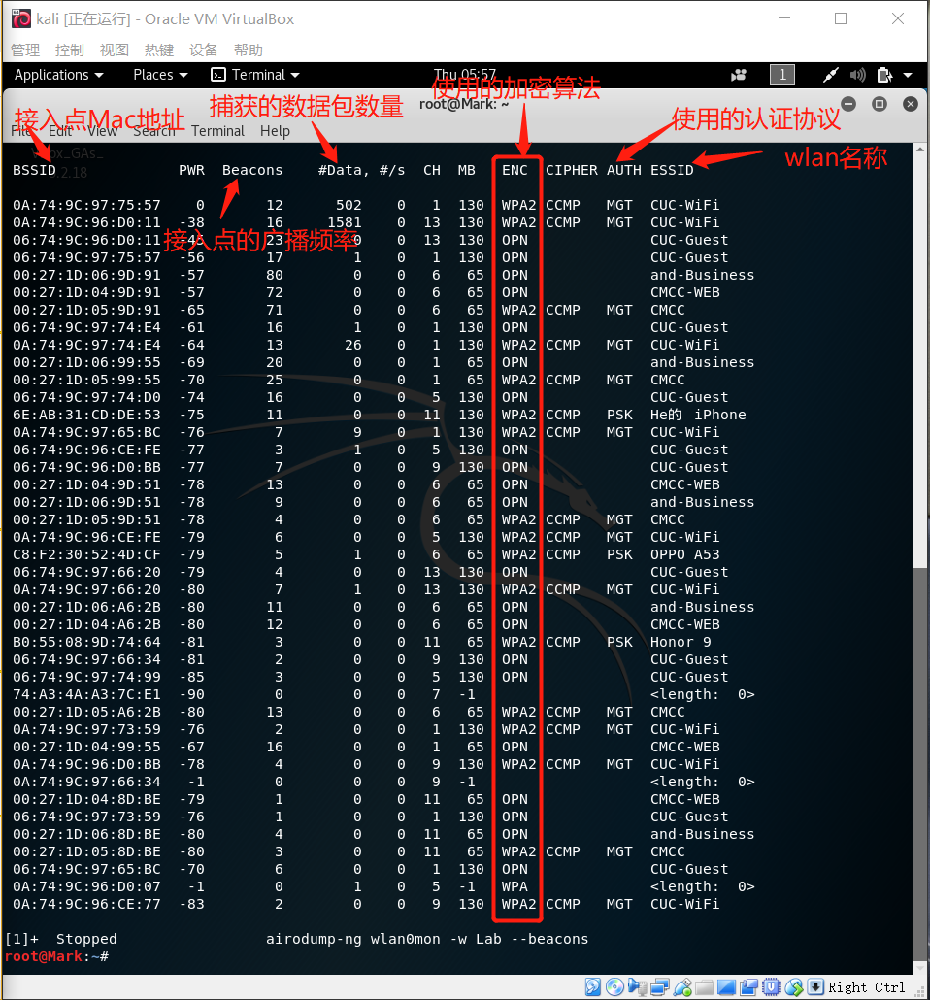
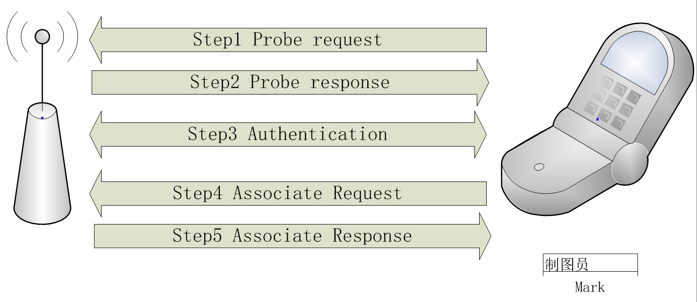
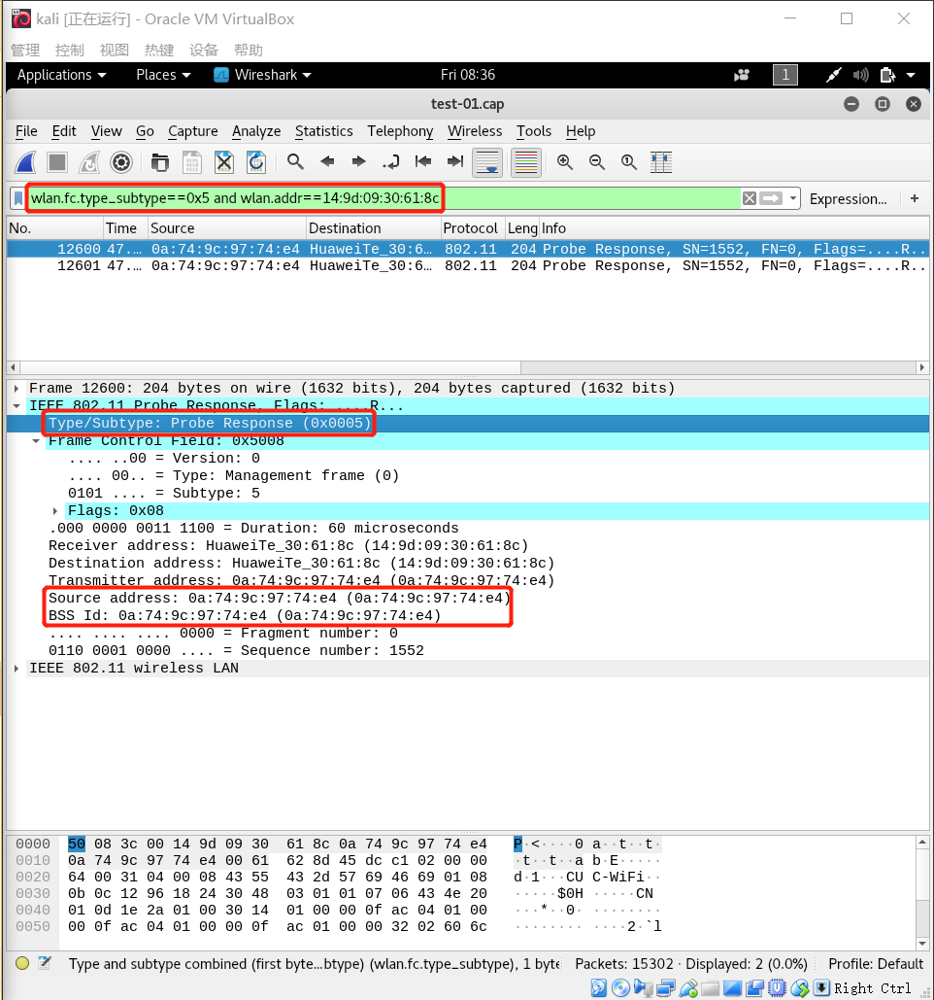
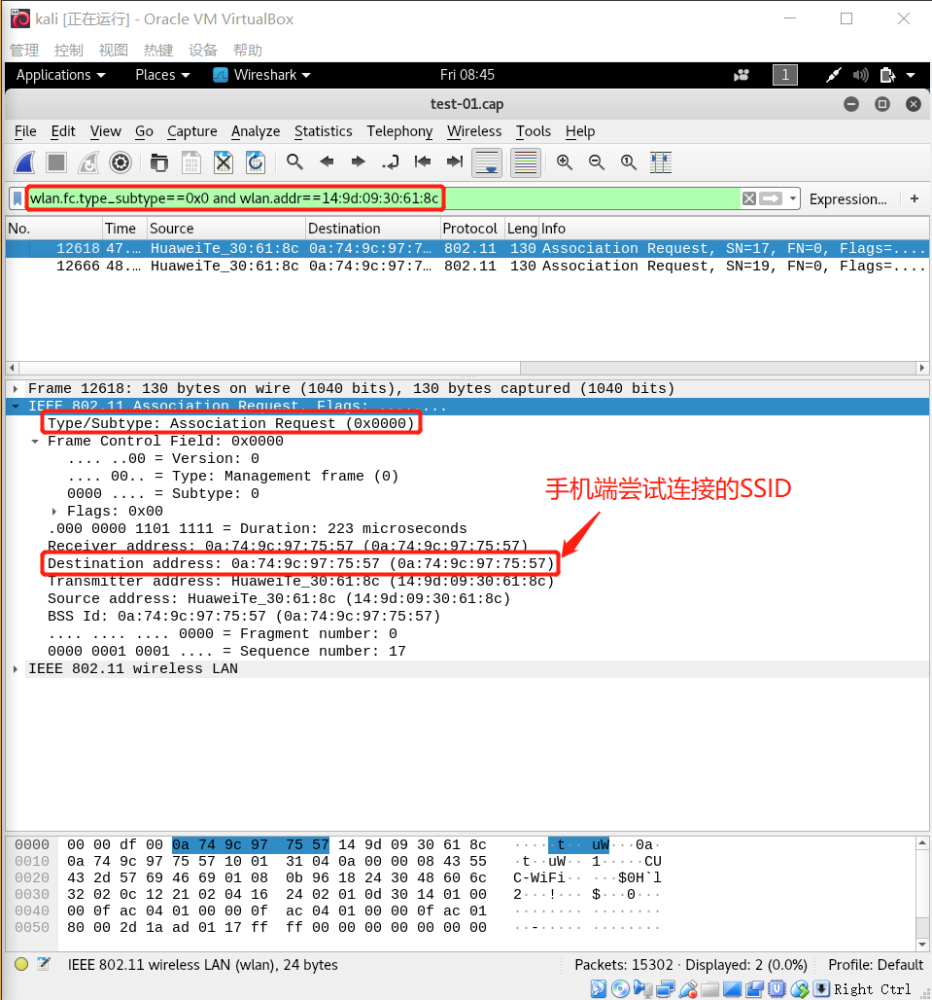
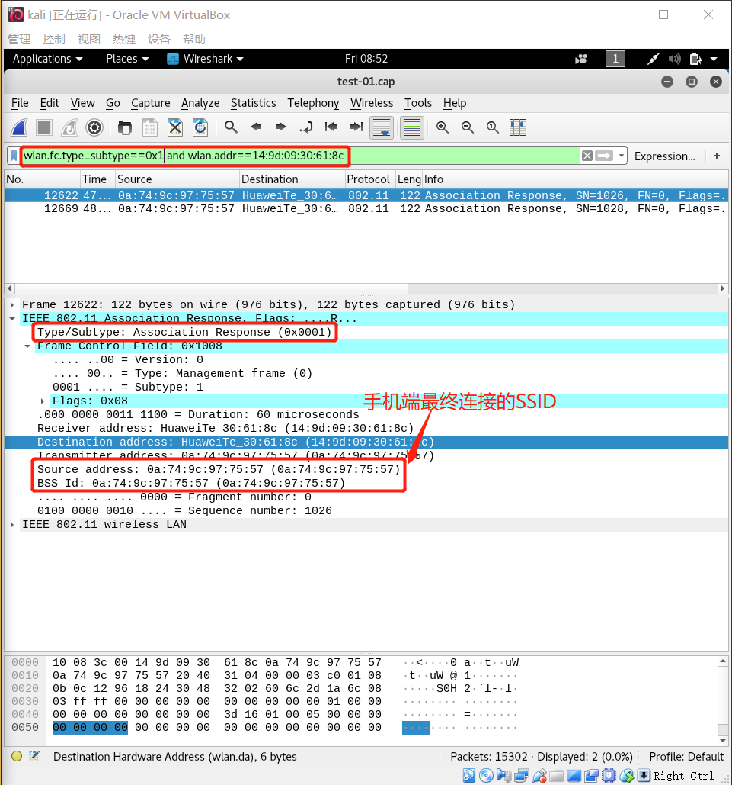
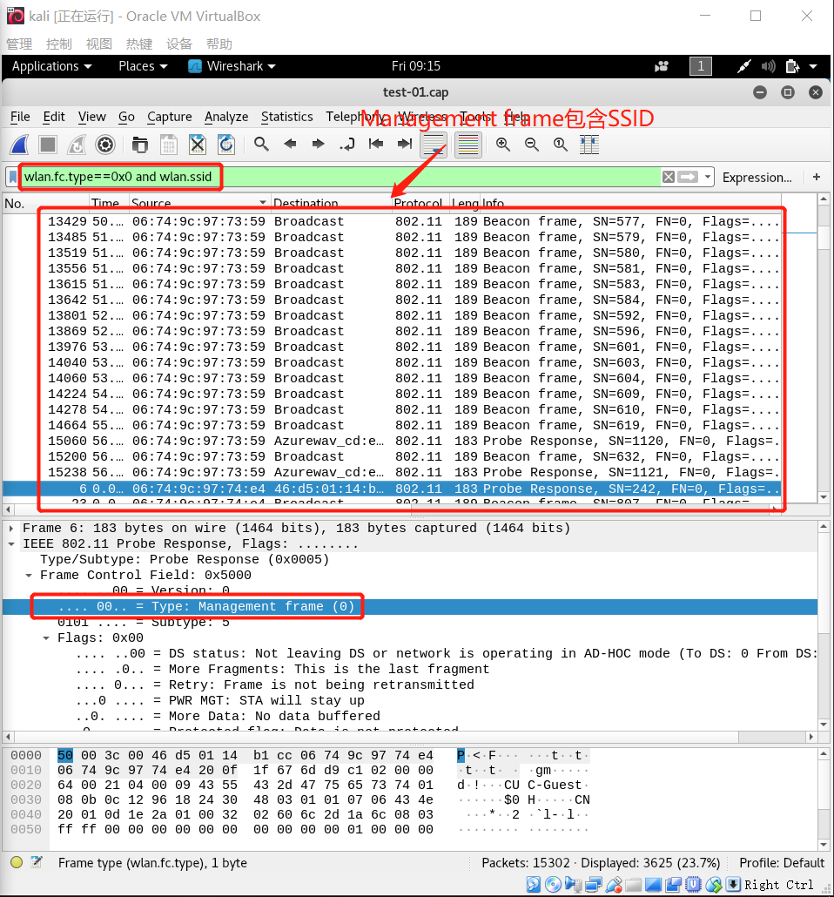
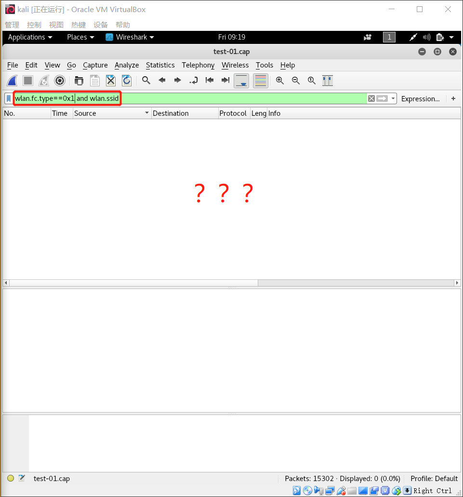
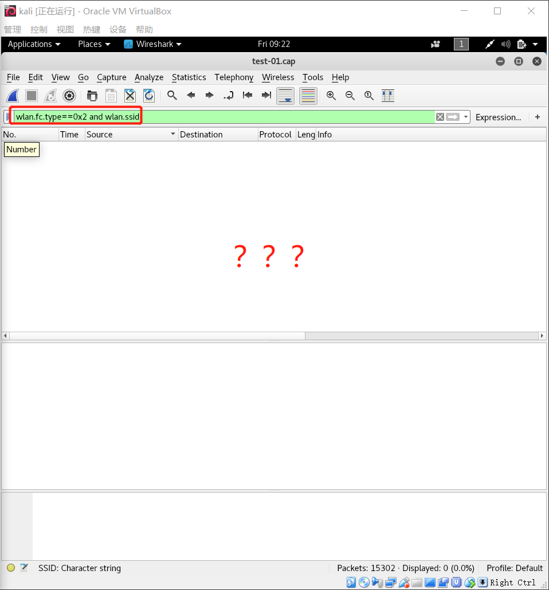

# chap0x02 802.11网络监听实验
## 实验环境
	虚拟机名称：kali
## 实验方案及过程
* step1 查看网卡工作模式
	* 指令
		<pre>root@Mark:~# iwconfig</pre>
	* 结果
		<pre>mode:Managed</pre>	
		
* step2 设置wlan0工作在监听模式
	* 指令
		<pre>root@Mark:~# airmon-ng start wlan0</pre>
	* 结果
		<pre>用root@Mark:~# iwconfig指令查看wlan0工作模式</pre>
		
* step3 开始以**channel hopping**模式抓包 监听结果保存在Lab-01.cap文件中
	* 实验要求为**统计当前信号覆盖范围内一共有多少独立的SSID** 所以不进行定向监听
	* 指令
		<pre>root@Mark:~# airodump-ng wlan0mon -w Lab --beacons</pre>
	* 结果
		
	* 用python分析wiresahrk生成的Lab-01.csv文件，打印需要的信息
		* python代码
		<pre>
		test=[]
		count=0
		with open('test.txt','r') as file:
		    a = file.readline()
		    while a:
		        test.append(a)
		        a = file.readline()
		for i in test:
		    a=i.split(',')
		    if len(a)==15:
		        count+=1
		        print("%-20s %-8s %-8s %-8s %-8s"%(a[0],a[3],a[5],a[6],a[13]))
		print('一共有',count,'个独立SSID')
		###############################输出结果#######################################
		# BSSID                 channel  Privacy  Cipher   ESSID  
		# 0A:74:9C:97:74:D0      5       WPA2     CCMP     CUC-WiFi
		# 0A:74:9C:96:CE:77      9       WPA2     CCMP     CUC-WiFi
		# 0A:74:9C:96:D0:07      5       WPA                      
		# 06:74:9C:97:65:BC      1       OPN               CUC-Guest
		# 00:27:1D:05:8D:BE     11       WPA2     CCMP     CMCC   
		# 00:27:1D:06:8D:BE     11       OPN               and-Business
		# 06:74:9C:97:73:59      1       OPN               CUC-Guest
		# 06:74:9C:97:66:A2     13       OPN               CUC-Guest
		# 0A:74:9C:97:75:58      5                                
		# 06:74:9C:97:75:43     13       OPN               CUC-Guest
		# 06:74:9C:97:9C:D0      1       OPN               CUC-Guest
		# 0A:74:9C:97:9C:D0      1       WPA2     CCMP     CUC-WiFi
		# 0A:74:9C:97:75:43     13       WPA2     CCMP     CUC-WiFi
		# 06:74:9C:96:D0:57     13       OPN               CUC-Guest
		# 00:27:1D:04:8D:BE     11       OPN               CMCC-WEB
		# 0A:74:9C:97:66:34      9                                
		# 0A:74:9C:96:CE:D6     13       WPA2     CCMP     CUC-WiFi
		# 0A:74:9C:96:D0:BB      9       WPA2     CCMP     CUC-WiFi
		# 00:27:1D:04:99:55      1       OPN               CMCC-WEB
		# 0A:74:9C:97:73:59      1       WPA2     CCMP     CUC-WiFi
		# 00:27:1D:05:A6:2B      6       WPA2     CCMP     CMCC   
		# 74:A3:4A:A3:7C:E1      7                                
		# 06:74:9C:97:74:99      5       OPN               CUC-Guest
		# 06:74:9C:97:66:34      9       OPN               CUC-Guest
		# B0:55:08:9D:74:64     11       WPA2     CCMP     Honor 9
		# 00:27:1D:04:A6:2B      6       OPN               CMCC-WEB
		# 00:27:1D:06:A6:2B      6       OPN               and-Business
		# 0A:74:9C:97:66:20     13       WPA2     CCMP     CUC-WiFi
		# 06:74:9C:97:66:20     13       OPN               CUC-Guest
		# C8:F2:30:52:4D:CF      6       WPA2     CCMP     OPPO A53
		# 0A:74:9C:96:CE:FE      5       WPA2     CCMP     CUC-WiFi
		# 00:27:1D:05:9D:51      6       WPA2     CCMP     CMCC   
		# 00:27:1D:06:9D:51      6       OPN               and-Business
		# 00:27:1D:04:9D:51      6       OPN               CMCC-WEB
		# 06:74:9C:96:D0:BB      9       OPN               CUC-Guest
		# 06:74:9C:96:CE:FE      5       OPN               CUC-Guest
		# 0A:74:9C:97:65:BC      1       WPA2     CCMP     CUC-WiFi
		# 6E:AB:31:CD:DE:53     11       WPA2     CCMP     He的 iPhone
		# 06:74:9C:97:74:D0      5       OPN               CUC-Guest
		# 00:27:1D:05:99:55      1       WPA2     CCMP     CMCC   
		# 00:27:1D:06:99:55      1       OPN               and-Business
		# 0A:74:9C:97:74:E4      1       WPA2     CCMP     CUC-WiFi
		# 06:74:9C:97:74:E4      1       OPN               CUC-Guest
		# 00:27:1D:05:9D:91      6       WPA2     CCMP     CMCC   
		# 00:27:1D:04:9D:91      6       OPN               CMCC-WEB
		# 00:27:1D:06:9D:91      6       OPN               and-Business
		# 06:74:9C:97:75:57      1       OPN               CUC-Guest
		# 06:74:9C:96:D0:11     13       OPN               CUC-Guest
		# 0A:74:9C:96:D0:11     13       WPA2     CCMP     CUC-WiFi
		# 0A:74:9C:96:D0:12      4                                
		# 0A:74:9C:97:75:57      1       WPA2     CCMP     CUC-WiFi
		# 一共有 52 个独立SSID
		</pre>
		* 查看统计当前信号覆盖范围内一共有多少独立的SSID？是否包括隐藏SSID?
			* 一共有52个独立SSID，隐藏SSID则ESSID值应该为空，根据上面打印的结果可知其中包含隐藏SSID。
		* 哪些无线热点是加密/非加密的？加密方式是否可知？
			* 输出结果中Privacy列表示热点是否加密以及热点的加密方式，OPN表示非加密。
			* 打印加密SSID及加密方式
			<pre>
			BSSID                 Privacy  ESSID  
			0A:74:9C:97:74:D0     WPA2     CUC-WiFi
			0A:74:9C:96:CE:77     WPA2     CUC-WiFi
			0A:74:9C:96:D0:07     WPA             
			00:27:1D:05:8D:BE     WPA2     CMCC   
			0A:74:9C:97:9C:D0     WPA2     CUC-WiFi
			0A:74:9C:97:75:43     WPA2     CUC-WiFi
			0A:74:9C:96:CE:D6     WPA2     CUC-WiFi
			0A:74:9C:96:D0:BB     WPA2     CUC-WiFi
			0A:74:9C:97:73:59     WPA2     CUC-WiFi
			00:27:1D:05:A6:2B     WPA2     CMCC   
			B0:55:08:9D:74:64     WPA2     Honor 9
			0A:74:9C:97:66:20     WPA2     CUC-WiFi
			C8:F2:30:52:4D:CF     WPA2     OPPO A53
			0A:74:9C:96:CE:FE     WPA2     CUC-WiFi
			00:27:1D:05:9D:51     WPA2     CMCC   
			0A:74:9C:97:65:BC     WPA2     CUC-WiFi
			6E:AB:31:CD:DE:53     WPA2     He的 iPhone
			00:27:1D:05:99:55     WPA2     CMCC   
			0A:74:9C:97:74:E4     WPA2     CUC-WiFi
			00:27:1D:05:9D:91     WPA2     CMCC   
			0A:74:9C:96:D0:11     WPA2     CUC-WiFi
			0A:74:9C:97:75:57     WPA2     CUC-WiFi 
			</pre>
* step4 重新进行定向抓包 结果保存在test-01.cap文件中
	* 之后的问题涉及客户端与AP整个连接过程，之前用channel hopping抓包可能导致包的丢失，无法抓到整个连接过程的packet。所以现在进行定向抓包 设置信道为1,保存到test.cap文件中.
	* 指令
		<pre>root@Mark:~# airodump-ng wlan0mon -c 1 -w test --beacons</pre>
	* 通过实验认为手机端连接SSID的过程大致为：探测请求(probe request)->探测响应(probe response)->身份验证(Authentication)->连接请求(Associate Request)->连接响应(Associate response)。(此处我以WLAN地址为14:9d:09:30:61:8c的手机端为例)。可通过收发帧的顺序分析整个连接过程。
		
* step5 添加过滤条件，筛选出手机端收到帧为IEEE 802.11 probe response(AP响应手机端的请求)
	* 通过帧的源地址即可知手机端无线网络列表可以看到哪些SSID
	* 在wireshark过滤窗口添加过滤条件
		<pre>wlan.fc.type_subtype==0x5 and wlan.addr==14:9d:09:30:61:8c</pre>
	* 结果如下图,则手机端无线网络列表只能看到一个SSID
		
* step6 添加过滤条件，筛选出手机端发出帧为IEEE 802.11 Association request(手机端请求加入SSID)
	* 通过帧的目的地址即可知手机端曾尝试连接哪些SSID
	* 在wireshark过滤窗口添加过滤条件
		<pre>wlan.fc.type_subtype==0x0 and wlan.addr==14:9d:09:30:61:8c</pre>
	* 结果如下图,则手机端曾尝试连接过一个SSID(0a:74:9c:97:75:57)
		
* setp7 添加过滤条件，筛选出手机端收到帧为IEEE 802.11 Association response(AP响应手机端的连接请求)
	* 通过帧的源地址即可知手机端最终连接了哪个SSID
	* 在wireshark过滤窗口添加过滤条件
		<pre>wlan.fc.type_subtype==0x1 and wlan.addr==14:9d:09:30:61:8c</pre>
	* 结果如下图,则手机端最终加入的SSID为(0a:74:9c:97:75:57)
		
* step8 SSID包含在哪些类型的802.11帧
	* 802.11帧分3类(Management frame,control frame,data frame).

	* 在wireshark过滤窗口添加过滤条件
		<pre>wlan.fc.type==0x0 and wlan.ssid</pre>
	* 结果如下图，有返回结果说明SSID包含在Management frame
		

	* 在wireshark过滤窗口添加过滤条件
		<pre>wlan.fc.type==0x1 and wlan.ssid</pre>
	* 结果如下图，没有返回结果说明SSID不包含在Control frame
		

	* 在wireshark过滤窗口添加过滤条件
		<pre>wlan.fc.type==0x2 and wlan.ssid</pre>
	* 结果如下图，没有返回结果说明SSID不包含在Data frame
		
## 实验备注
* 参考资料
	* [https://blog.csdn.net/u010164190/article/details/70231820](https://blog.csdn.net/u010164190/article/details/70231820)
	* [https://blog.csdn.net/qq_28208251/article/details/47975161](https://blog.csdn.net/qq_28208251/article/details/47975161)
* 参考同学作业
	* [https://github.com/CUCCS/2018-NS-Public-luyj/blob/mis_chap0x02/mis_chap0x02/mis_chap0x02.md](https://github.com/CUCCS/2018-NS-Public-luyj/blob/mis_chap0x02/mis_chap0x02/mis_chap0x02.md)

